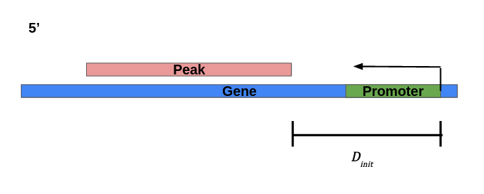

# SMRF-init-distances

Measuring distances between TSSs (Transcription start sites) and the beginning
of SMRF-seq (Single molecule R-loop footprinting) peaks for both genomic and
plasmid (pFC8 and pFC53) reads. Shown as D<sub>init</sub> in the diagram
below.



## Running the workflow

This workflow depends on [Snakemake](https://snakemake.readthedocs.io/en/stable/)
for execution and [Conda](https://www.anaconda.com/products/individual) for all
other software dependencies. Once you have these programs installed on your
machine the pipeline can be run with the command below from this repositories
outermost directory.

```
snakemake -j 1 --use-conda
```

For more advanced execution configure `run.sh` and / or `cluster.yml`
to execute the workflow jobs in parallel using SLURM.
